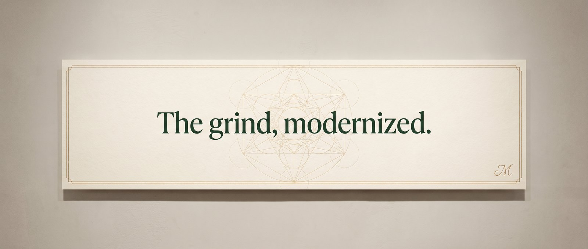

  

<h1 align="center">David Olverson</h1>

<strong>Solo AI-Native Developer · Founder of <a href="https://moderngrindtech.com">Modern Grind Technology</a></strong>

  
  
  
  
  

---

I ship production-grade AI-native software as a solo studio — moving at the velocity of a four-person team by running Claude Code as my primary development environment.

### What I build

- **AI-native full-stack applications** — Next.js App Router, TypeScript, FastAPI, PostgreSQL
- **Claude Code agent workflows** — custom skills, MCP servers, subagent orchestration
- **Production systems at scale** — 10+ shipped apps across real estate, fintech, gaming, and content automation

### Selected work

| Project | Stack | Status |
|---|---|---|
| **[Modern Grind Technology](https://moderngrindtech.com)** | Next.js 16, Tailwind v4, Prisma | Live |
| **eXp Richmond PLE** | Next.js, PostgreSQL, DPOR-compliant 30hr course | Live |
| **Cardinal** | Next.js, MLS integration, VA real estate | Live |
| **2K-Hub** | Next.js, Neon, Discord integration | Live |
| **Service Plug** | Next.js, Discord bot orchestration | Live |
| **Holy Services** | Discord bot, Railway, 2K26 marketplace | Live |

### Stack

**Frontend** · Next.js 16 · React · TypeScript · Tailwind v4 · ShadCN UI
**Backend** · FastAPI · Node.js · Python · PostgreSQL · Prisma · asyncpg
**AI / Agents** · Claude Code · Model Context Protocol · Anthropic SDK · LangChain
**Infra** · Vercel · Railway · DigitalOcean (Coolify) · Neon · Cloudflare

### GitHub activity

  
  

  

### Background

- US Army 92Y Unit Supply Specialist (2016–2021)
- 2K UPA professional esports competitor
- Writing code since age 15
- Based in Virginia, USA

### Find me

- **Website** · [moderngrindtech.com](https://moderngrindtech.com)
- **About** · [moderngrindtech.com/about](https://moderngrindtech.com/about)
- **LinkedIn** · [david-olverson](https://www.linkedin.com/in/david-olverson-6314563b2/)
- **X** · [@ModernGrindTech](https://x.com/ModernGrindTech)
- **Discord** · [discord.gg/moderngrindtech](https://discord.gg/moderngrindtech)
- **Email** · david@moderngrindtech.com

### Open to

- AI engineer / staff engineer roles at AI-forward product companies
- Technical founder / founding engineer conversations
- High-leverage freelance engagements
